# bmcu-guide
This is everything I found with bmcu and my setup instructions

## BMCU

Link to the original page: https://oshwhub.com/bamboo-shoot-xmcu-pcb-team/bmcu

## PCB Components

## Mechanical Parts

| parts |  image | quantity | url|
|------|---|----|-----|
| D2x10mm shaft|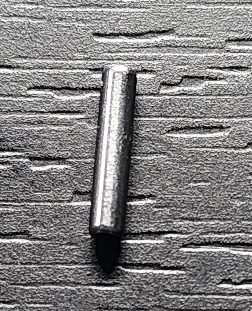| 16| 
| D5x22mm shaft|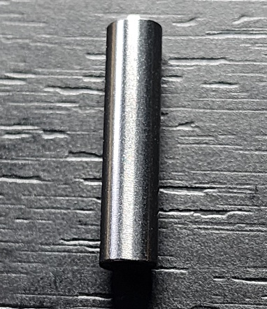| 4| 
| D2x20mm shaft| 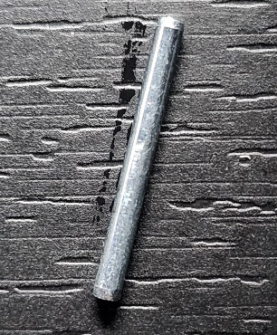 | 12| 
| 20082b gear|| 8| https://www.aliexpress.us/item/2251832773767691.html?channel=twinner |
| 182A gear|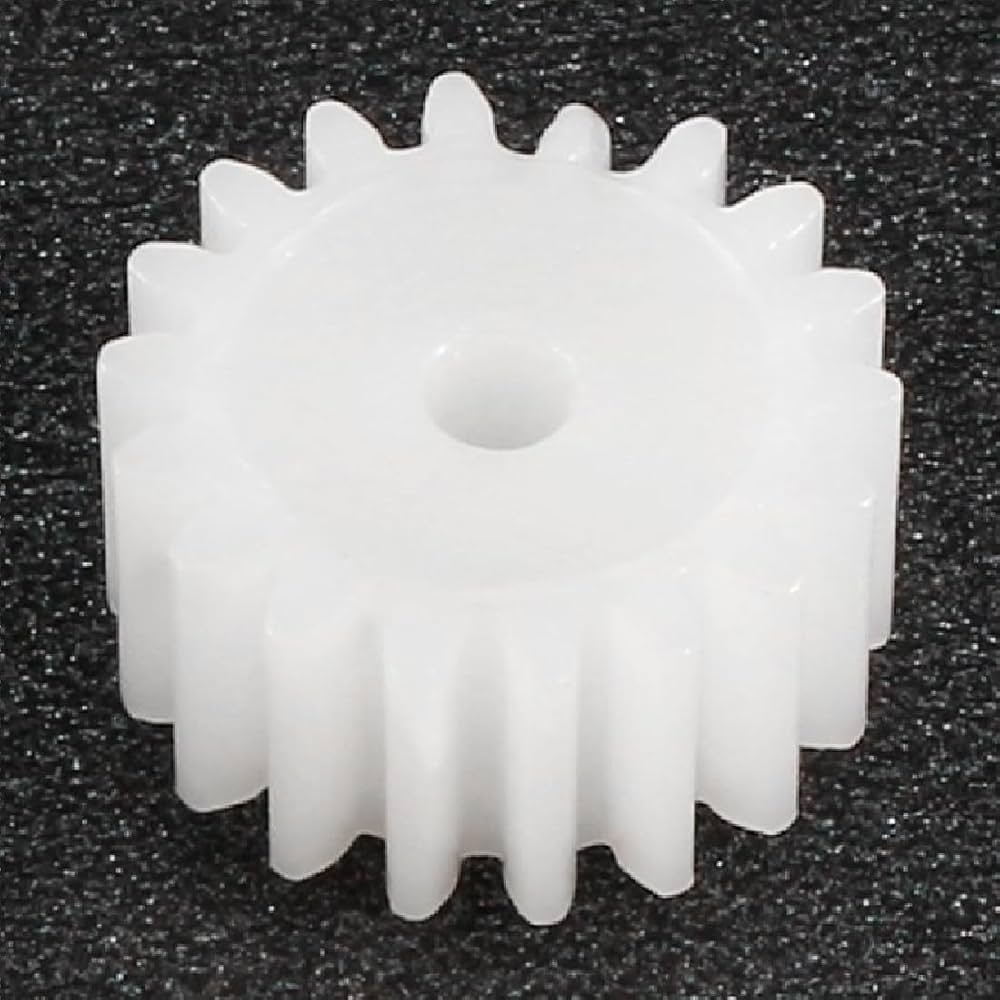| 8| https://www.aliexpress.us/item/3256805882541566.html?channel=twinner |
| W6X82A gear|| 4| 
| 242A gear| 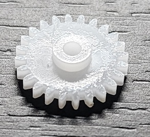| 4| https://www.aliexpress.us/item/2251832772413347.html?channel=twinner| 
| FF-130SH DC motor|| 4| https://www.aliexpress.us/item/3256806534762641.html?channel=twinner  | 
| 62B bushing|| 28| 
| PC4-M6  connector|| 4 (suggest 8)| https://www.aliexpress.us/item/3256805460431392.html?channel=twinner  | 
| 0.5x6x10mm spring| 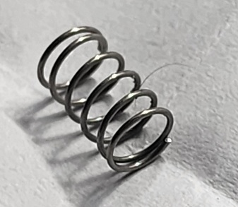 | 4 | 
| 0.6x4x10mm spring| 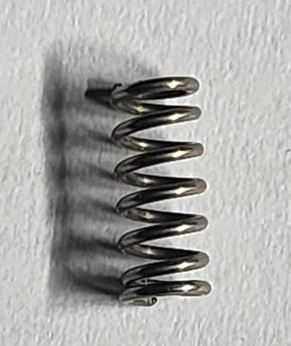 | 4 | https://www.aliexpress.us/item/3256805126192641.html?channel=twinner  | 
| m2x8  screw heads|| 60 | 
| MBG gear set|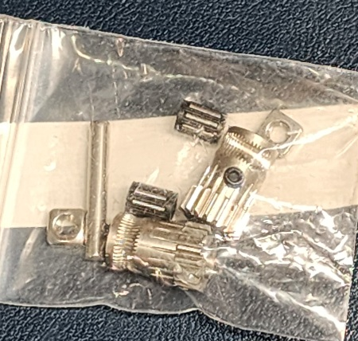| 4 | 
| MR85ZZ bearing | | 8 | 
|wires|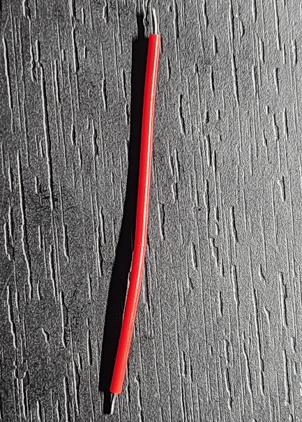|8|
|round magnet D6x2.5 (optional)|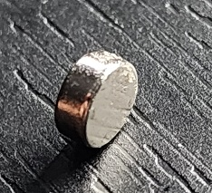| 4|
|AMS cable header (dont know exactly what brand)|| 2|
|dupont female header (small)|| 8|

You will also need lubricating oil/grease, a screwdriver and soldering tools

### Setup

After printed all the parts

1. insert the D2x10 shafts into 182A gears, and D2x20 shaft into 242A gear like this

    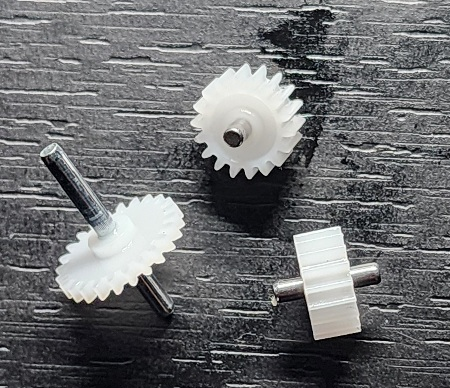
2.  Take 2 triangle parts and insert the gears. pay attention to the direction of 242A gear (red box)

    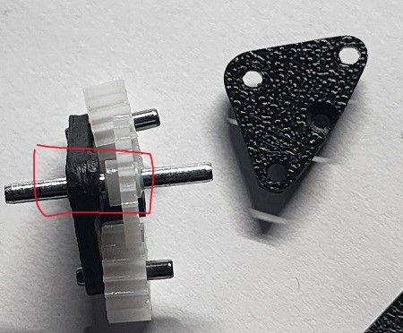
3.  Assembling 2 part and secure with the m2 screw. You should also lubricate the gears with oil at this step

    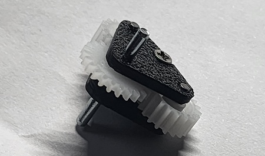
4. Screw the pneumatic fitting to this part, and add 0.5x6x10 spring + 62B bushing at the bottom

    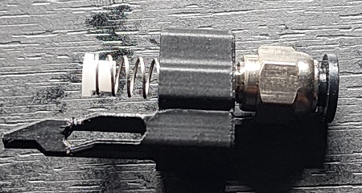
5. insert that block into the bottom case. You  should also add some oil into the marked regions. After everything is in place, push the component downward to make sure it is sliding smoothly.

    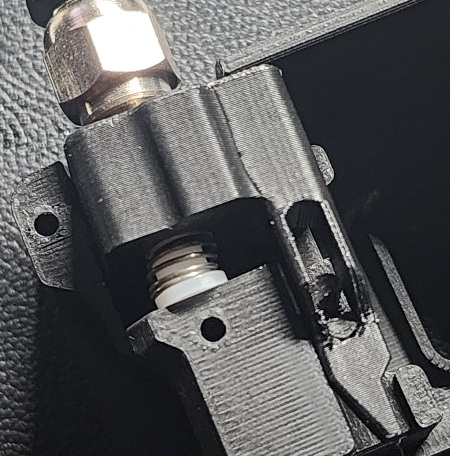
    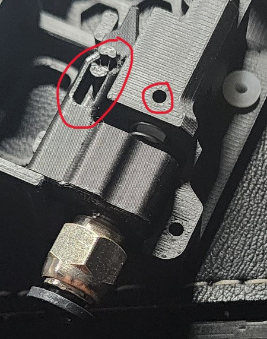
6. take a BMG gear (the one with side screw-hole), D5x22 shaft and 2 MR85zz ball bearings and assemble like in this image.  The thick shaft at one end needs to be flush with the bearing.

    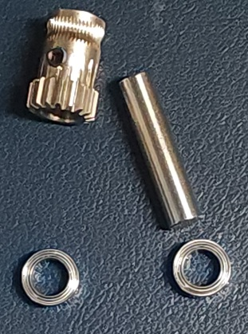
    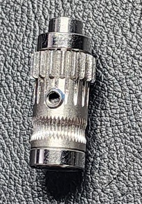

7. insert the 62B bushing into the bottom case like this

    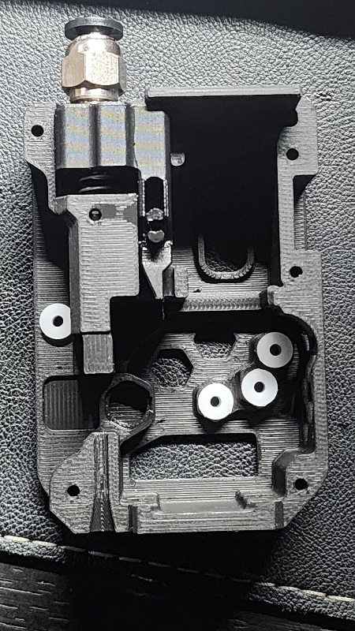
8. Insert the above components + 2 long shafts into the bottom case like these images. Pay attention to the direction of BMG gear and the triangle part

    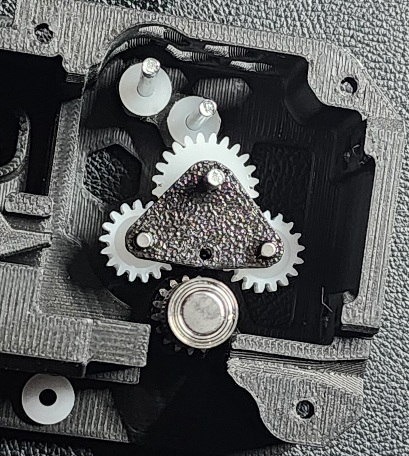
    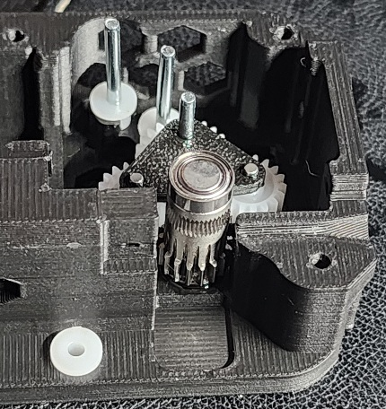

9. Add 2 20082b gears to the long shafts

    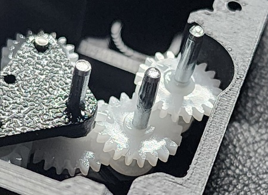
10. insert a bushing to this part and insert it into the bottom case:

    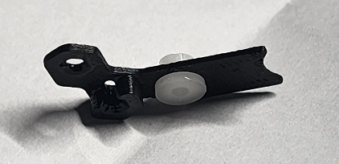
    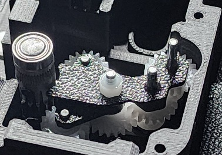
11. insert W6X82A gear to the motor, and solder the wire from the motor to the board (V go to the red spot on motor)

    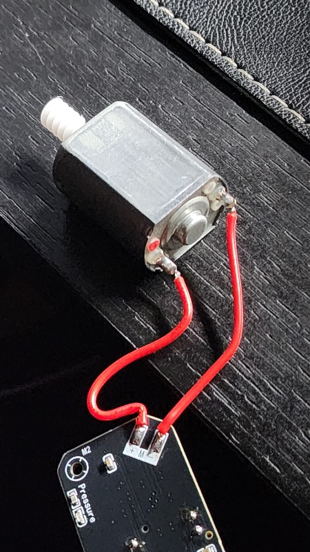
12. Insert the motor to the bottom case, (the red/ positive wire face up)

    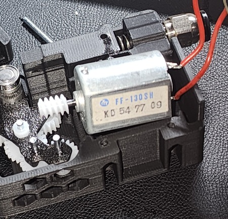
    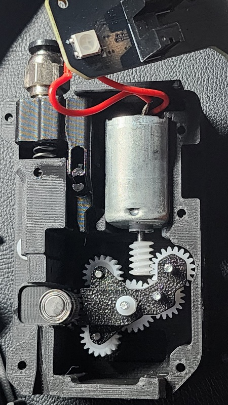

13. Take the top case and assemble to the bottom case (align the wire to the marked region). Add the magnet to the BMG gear

    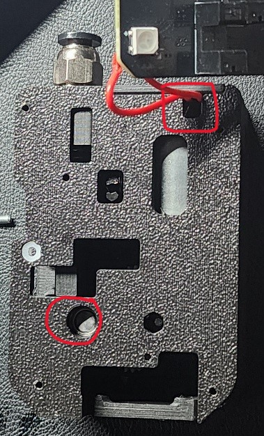

14. place the board on the top case, and tighten with screws. secure 2 parts with 5 screws.

    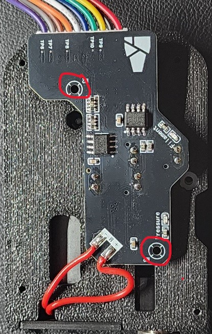
    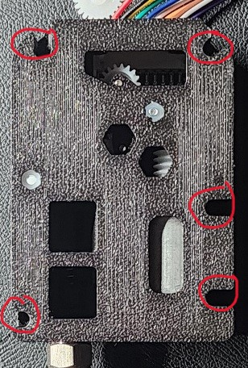
15. Assemble the BMG gear (D3x20 shaft included in BMG gear set), and insert them to this printed part (pay attention to the direction)

    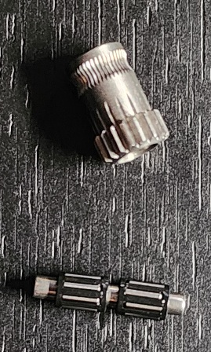
    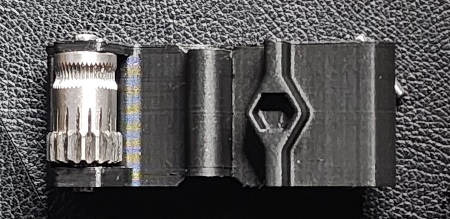

16. insert the 62B bushing to the top case and add the thin spring like this. Then insert the above part and fixed by 2 D2x10 shafts

    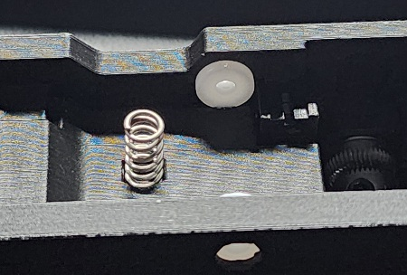
    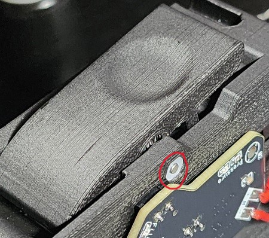

17. Insert the top cover

    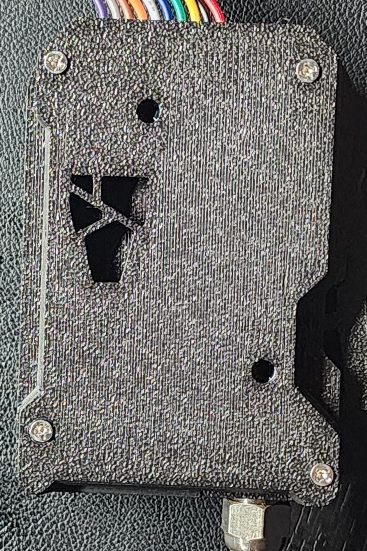

18. [note on making AMS cable] 1m is enough if you want to place the kit on top of the printer, or by side. the pinouts on both ends must be in the same order, shown in this image:

    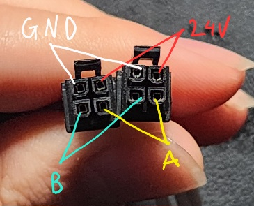

### Firmware

The board is already flashed with firmware so you wont need to flash the binary into the board. However you can still load new firmware to the board with USB-TTL in case new firmware is available
